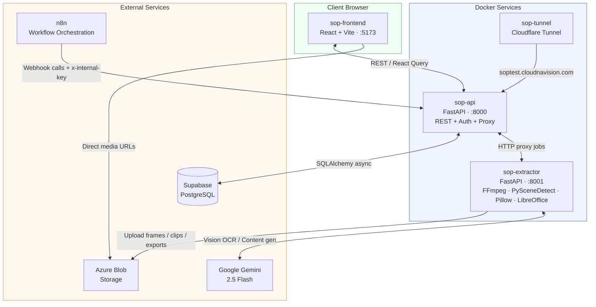
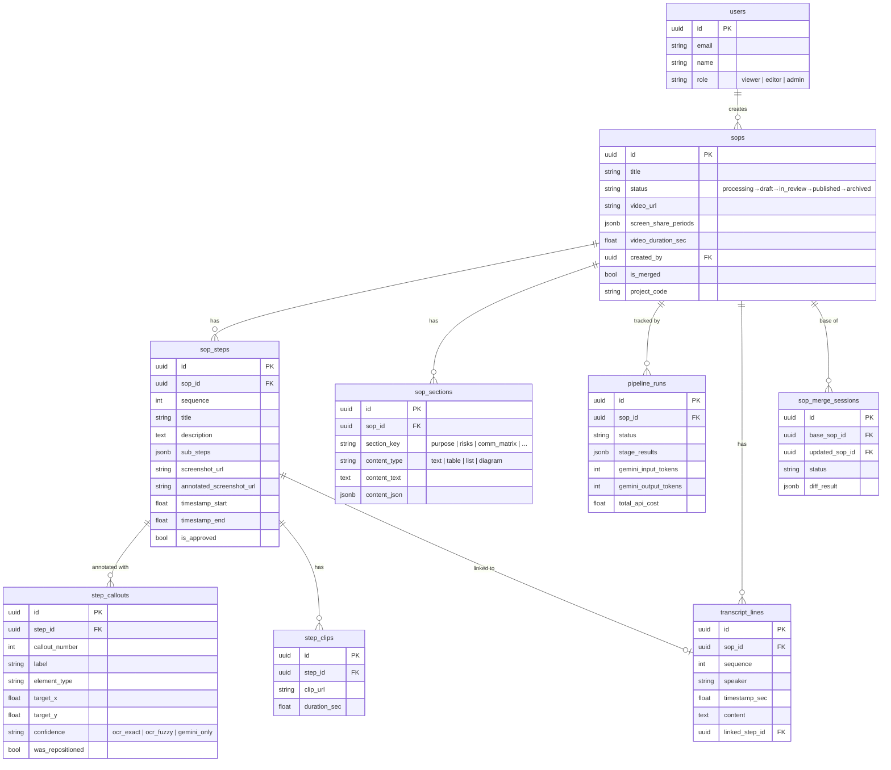
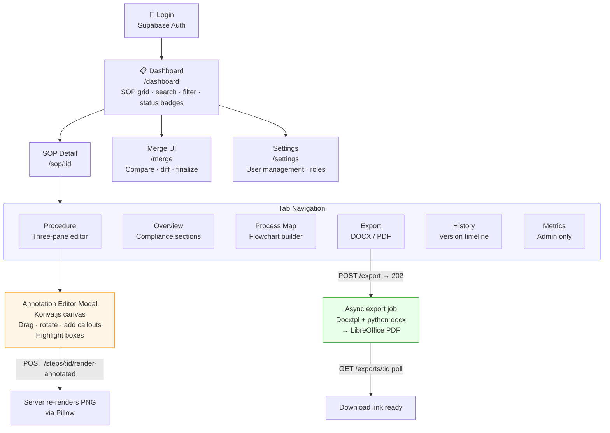

# How I Built an AI Pipeline That Turns Training Videos Into Enterprise SOPs in 4 Minutes

*From raw KT recordings to publication-ready documentation — end to end, fully automated.*

> **Note for Medium publishing:** The diagrams below are written in [Mermaid](https://mermaid.live). Paste each block at [mermaid.live](https://mermaid.live), export as PNG, then embed the image in your Medium draft.

---

## The Problem

Every enterprise has the same invisible bottleneck: institutional knowledge is locked inside videos.

Training sessions, knowledge transfer recordings, software walkthroughs, compliance demos — they all end up as 30-60 minute video files sitting in SharePoint folders. When a new employee needs to learn a process, they either watch the full video (slow) or ask a colleague to re-explain it (expensive). When compliance requires documentation, someone has to watch the video and manually write it all down — which takes days.

I was tasked with solving this for Starboard Hotels. Their operations team was recording Microsoft Teams knowledge transfer (KT) sessions, then spending hours manually converting them into Standard Operating Procedures. The question was: could we automate the entire pipeline?

The answer was yes. Here is how I built it.

---

## What the Platform Does

The **Video Document Intelligence Platform** takes a raw training or demonstration video and produces a complete, publication-ready SOP package in under 4 minutes:

- A fully structured procedure document with numbered steps and annotated screenshots
- Speaker-separated transcript synced to the video timeline
- An interactive process map and decision flowchart
- A compliance overview covering Purpose, Scope, Inputs, Risks, and Prerequisites
- One-click export to formatted DOCX or PDF

No manual effort required after upload.

---

## Architecture Overview

The system is built as a containerised microservices stack with four Docker services and four external integrations.



**Four Docker services:**
- **sop-frontend** — React SPA (Vite) for SOP review and editing
- **sop-api** — FastAPI REST API for data management and pipeline orchestration
- **sop-extractor** — The heavy-lifting service: FFmpeg, PySceneDetect, Pillow, LibreOffice
- **sop-tunnel** — Cloudflare Tunnel for secure external access

**External services:**
- **Supabase PostgreSQL** — Primary database with Row-Level Security
- **Azure Blob Storage** — Media and export file storage
- **n8n** — Workflow automation orchestration
- **Google Gemini 2.5 Flash** — AI model for transcription, annotation, and content generation

---

## The Processing Pipeline

The automation runs through six chained n8n workflows. A video uploaded to SharePoint triggers the entire chain automatically — no human intervention until the draft SOP appears in the UI.

```mermaid
flowchart TD
    SP(["📁 SharePoint\nNew video upload"])

    subgraph WF0["WF0 — Smart Ingest & Auto-Split"]
        W0A["Generate SOP UUID\nProbe video duration"]
        W0B{"Video > 30 min?"}
        W0C["FFmpeg stream-copy split\nat nearest keyframe"]
        W0D["Upload to Azure Blob"]
    end

    subgraph WF1["WF1 — Ingestion & Transcription"]
        W1A["Gemini File API\nFull audio transcription"]
        W1B["Gemini Vision\nDetect screen-share periods\n+ crop bounding boxes"]
        W1C["Create sops record\nStore transcript_lines"]
    end

    subgraph WF2["WF2b — Frame Extraction"]
        W2A["FFmpeg crop + trim\nto screen-share window"]
        W2B["PySceneDetect\nAdaptiveDetector threshold=3.0"]
        W2C["Extract PNG at T+1.5s\nper scene boundary"]
        W2D["imagehash dedup\nHamming distance ≤ 8"]
        W2E["Upload frames to Azure\nWrite sop_steps to DB"]
    end

    subgraph WF3["WF3c — AI Annotation Generation"]
        W3A["Gemini Vision OCR\nper screenshot"]
        W3B["Match text → UI elements\nocr_exact / ocr_fuzzy / gemini_only"]
        W3C["Store step_callouts\npixel coordinates + labels"]
    end

    subgraph WF4["WF4 — Extract Video Clips"]
        W4A["FFmpeg stream-copy\nper step window"]
        W4B["Upload MP4 clips\nCreate step_clips records"]
    end

    subgraph WF5["WF5b — Generate Step Content"]
        W5A["Gemini: step titles\ndescriptions + sub-steps"]
        W5B["Gemini: full compliance overview\nPurpose · Risks · Matrices · etc."]
        W5C["Create sop_sections\nMark pipeline completed"]
    end

    DONE(["✅ SOP Draft Ready\nin Web UI"])

    SP --> WF0
    W0A --> W0B
    W0B -->|Yes| W0C --> W0D
    W0B -->|No| W0D
    W0D --> WF1
    W1A --> W1B --> W1C --> WF2
    W2A --> W2B --> W2C --> W2D --> W2E --> WF3
    W3A --> W3B --> W3C --> WF4
    W4A --> W4B --> WF5
    W5A --> W5B --> W5C --> DONE

    style WF0 fill:#e8f4fd,stroke:#2196f3
    style WF1 fill:#e8fde8,stroke:#4caf50
    style WF2 fill:#fdf3e8,stroke:#ff9800
    style WF3 fill:#fde8f4,stroke:#e91e8c
    style WF4 fill:#f4e8fd,stroke:#9c27b0
    style WF5 fill:#e8fdfd,stroke:#009688
```



### WF0 — Smart Ingest & Auto-Split

When a new video appears in SharePoint, WF0 kicks off the chain:

1. Detects the new file and generates a unique SOP ID (UUID)
2. Downloads the video and probes its duration with `ffprobe`
3. For videos longer than ~30 minutes: automatically finds a logical split point at a keyframe boundary and splits into parts
4. Uploads all parts to Azure Blob Storage
5. Triggers WF1

The long video splitting was a non-trivial problem. Gemini's File API has roughly a 2-hour limit, and a 45-minute Teams recording can be 2-3 GB. The split logic finds the nearest keyframe to the target split point (within a ±300s window), stream-copies both parts with FFmpeg (no re-encode, fast and lossless), and uploads them with correct timestamp offsets so downstream steps align correctly to the original video.

### WF1 — Ingestion & Transcription

WF1 handles the audio intelligence layer:

1. Calls **Gemini File API** to transcribe the full audio
2. Runs a second Gemini vision pass to detect screen-share periods — exact timestamps when a participant is sharing their screen, plus bounding box coordinates for the shared region
3. Creates the `sops` record in Supabase with meeting metadata
4. Stores all transcript lines in `transcript_lines` with speaker attribution and timestamps
5. Passes screen-share crop coordinates to WF2

The screen-share detection step is important. Teams recordings include webcam tiles at the edges of the frame. By detecting which periods are actual screen shares (and the precise crop region), later stages can crop out the participant video and focus on just the application content.

### WF2b — Frame Extraction

This is the most computationally intensive step. WF2b calls the `sop-extractor` service, which runs:

```
1. Download video from Azure Blob (streaming, HTTP range requests, retry on interruption)
2. For each screen_share_period:
   a. FFmpeg: crop to bounding box + trim to period window
   b. PySceneDetect: detect scene changes (AdaptiveDetector, threshold=3.0)
   c. Extract one PNG per scene at T+1.5s (avoids sharp transitions)
   d. imagehash dedup: perceptual hashing, Hamming distance ≤ 8
   e. Fallback: force one frame every 120s for static content (e.g. slide decks)
3. Upload useful frames to Azure Blob
4. Write sop_steps directly to Supabase
```

A 45-minute recording typically yields 11-15 useful frames after deduplication. The `T+1.5s` offset per scene turned out to be critical — extracting at the scene boundary captures the transition animation rather than the stable state. The 1.5s offset gets you the first fully-rendered state of each new screen.

The extractor uses a single semaphore (one job at a time) because a full video extraction loads 2-3 GB into memory. It returns `503 Service Unavailable` with a `Retry-After` header if busy, and n8n handles the retry.

### WF3c — AI Annotation Generation

For each extracted screenshot, WF3c calls Gemini vision to:

1. Run **OCR** on the screenshot to identify all visible text elements
2. Match OCR text to logical UI elements (buttons, folders, cells, menu items)
3. Generate numbered callout positions with confidence levels:
   - `ocr_exact` — Text matched verbatim
   - `ocr_fuzzy` — Partial/Levenshtein match
   - `gemini_only` — No OCR match, AI-estimated position

This creates `step_callouts` records: `{callout_number, label, target_x, target_y, element_type, confidence}`.

Coordinates are stored as raw pixels matching the original image dimensions — simpler to render than percentage-based coordinates.

### WF4 — Extract Video Clips

For each step, a short MP4 clip is cut from the original video:

```bash
ffmpeg -ss {start_sec} -to {end_sec} -i input.mp4 -c copy output.mp4
```

Stream-copy (`-c copy`) means no re-encode. A 30-second clip is ready in roughly 300ms. Clips are uploaded to Azure as `{sop_id}/clips/clip_{sequence:03d}.mp4`.

### WF5b — Generate Step Content + Sections

The final AI pass:

1. **Per step:** Gemini generates a step title, description (written in infinitive form: "Click the...", "Select the...", "Enter the..."), and sub-steps
2. **Overall SOP:** Gemini generates the full compliance overview — Purpose, Input, Process Description, Output, Risks, Training Prerequisites, Software & Access Requirements, Communication Matrices, Quality Parameters

This creates `sop_sections` records. The content can be `text`, `table`, `list`, or `diagram` type. The pipeline marks itself `completed` in `pipeline_runs`.

---

## The Database Schema

The PostgreSQL schema has 15 tables. Here are the core relationships:



The core tables:

**`sops`** — Master records with status lifecycle: `processing → draft → in_review → published → archived`

**`sop_steps`** — One row per screenshot. Stores the raw screenshot URL, annotated screenshot URL, step content, timestamps, and review status.

**`step_callouts`** — Annotation markers. Each callout has a pixel coordinate, confidence level, match method, and a flag if a human repositioned it during review.

**`sop_sections`** — Non-step content (purpose, risks, matrices). Supports text, table, list, and diagram content types.

**`pipeline_runs`** — Full pipeline state tracking. Stores per-stage results, Gemini token counts (for cost tracking), errors, and timing.

**`transcript_lines`** — Full transcript with speaker, timestamp, and an optional link to the step it corresponds to. Has a GIN trigram index for full-text search.

---

## The Web Interface

The frontend is a React + Vite SPA using TanStack Router (file-based routing) with React Query for server state.



### The Procedure Tab

The main editing interface is a three-pane layout:

- **Left pane:** Video player (Video.js) + transcript panel. Click any transcript line to seek to that position.
- **Middle pane:** Scrollable list of step cards. Click a step to seek the video and show its detail.
- **Right pane:** Step detail — annotated screenshot, callout list, description, sub-steps.

Keyboard navigation: left/right arrows move through steps.

### The Annotation Editor

Clicking "Edit" on any screenshot opens a full-screen Konva.js canvas modal. You can:

- Drag callout badges to reposition them
- Rotate callouts in ±45° increments
- Add new callouts by clicking on the screenshot
- Draw highlight boxes over UI regions

Saving calls `/api/steps/{id}/render-annotated`, which re-renders the screenshot server-side with Pillow. The server-side render matches the Konva.js canvas appearance exactly — same pentagon badge shapes, same colour coding, same scaling formula.

Cache busting is handled by appending the `updated_at` timestamp as a query param to the annotated screenshot URL.

### The Process Map Tab

A drag-and-drop flowchart builder. Steps can be arranged in swimlanes (by department or role), marked as decision points (diamond shape with Yes/No branches), and connected with arrows. Viewers get a read-only preview; editors can modify and save.

### The Merge UI

When the same process is recorded in multiple videos (e.g. an initial training and a revised version), the merge UI lets you:

1. Select two SOPs to compare
2. Trigger a Gemini semantic diff — it returns each step's status: unchanged, modified, deleted, or inserted
3. Review the side-by-side diff
4. Finalize the merge — creates a new SOP by copying steps, clips, and annotated screenshots from the appropriate source

---

## Document Export

The extractor generates DOCX files using `docxtpl` for variable injection and `python-docx` for table rendering (tables are added post-render to avoid XML corruption from docxtpl). LibreOffice headless converts DOCX → PDF.

Three template types are supported: `standard` (full SOP), `meeting_minutes`, and `webinar`.

The export pipeline is async — submitting an export returns a `202 Accepted` with an `export_id` immediately. The frontend polls the status endpoint. This avoids Cloudflare's 120-second proxy timeout for large SOPs with 26+ steps and many embedded screenshots.

---

## Security Architecture

**Authentication:** Supabase Auth JWT, validated on every request via JWKS.

**Authorization:** Three roles — Viewer, Editor, Admin. All 52 FastAPI routes have role decorators. Viewers see published SOPs only. Editors can modify steps and annotations. Admins manage users and roles.

**Pipeline auth:** n8n webhook calls include an `x-internal-key` header. All webhook receivers validate it before processing.

**CORS:** No wildcard. Hard-coded to four approved origins, plus a regex allowing `*.cloudnavision.com`.

**Row-Level Security:** RLS policies are written and staged (`009_enable_rls.sql`) — pending activation for production handover.

---

## Lessons Learned

**1. Never use `JSON.stringify()` with n8n's `specifyBody: "json"` mode.** n8n already serialises the body. Double-encoding sends a string instead of an object to the downstream service — a bug that surfaces as a mysterious 400 error with no clear message.

**2. Vertex AI cannot fetch Azure Blob URLs.** Gemini via Vertex AI needs media delivered as base64 `inlineData`, not a URL reference. WF3c downloads the image first, encodes it, and sends it inline.

**3. Scene detection threshold matters a lot.** Too low and you get dozens of nearly-identical frames. Too high and you miss real screen changes. `AdaptiveDetector` with threshold 3.0 plus the 1.5s offset per scene hit the right balance for Teams recordings.

**4. Async exports are non-negotiable.** LibreOffice conversion for a 20+ step SOP with full-resolution screenshots takes 60-90 seconds. Cloudflare will kill any synchronous request after 120 seconds. Build async from day one.

**5. Pillow badge rendering needs to match the canvas exactly.** When users edit callout positions in the browser (Konva.js) and save, the server re-renders the image with Pillow. If the shapes don't match pixel-for-pixel, every save looks like the annotation moved slightly. The fix was deriving the same scaling formula on both the client and server.

---

## Tech Stack Summary

| Layer | Technology |
|---|---|
| Frontend | React 18, Vite, TanStack Router, React Query, Konva.js, Video.js, Tailwind CSS |
| Backend API | FastAPI, SQLAlchemy (async), Pydantic, PyJWT |
| Extractor | FFmpeg, PySceneDetect, imagehash, Pillow, docxtpl, python-docx, LibreOffice |
| Database | PostgreSQL via Supabase (transaction pooler) |
| AI | Google Gemini 2.5 Flash (transcription, annotation, content generation) |
| Automation | n8n (6 chained workflows) |
| Storage | Azure Blob Storage |
| Infrastructure | Docker Compose, Cloudflare Tunnel |

---

## What's Next

The core platform is complete and deployed. On the roadmap:

- **Rate limiting** — slowapi middleware on the FastAPI layer
- **RLS activation** — row-level security policies are written, pending production flip
- **Process map v2** — enhanced swimlane builder with better layout algorithms
- **Dark mode** — the design is ready

---

## Closing Thoughts

The most interesting part of this project was not any single component in isolation — it was making all the pieces work together reliably under real-world conditions: unreliable network connections, large video files, Cloudflare proxy timeouts, n8n's serialisation quirks, and Gemini's varying OCR confidence levels.

The result is a platform that genuinely solves a real problem. What used to take a documentation writer two to three days now takes four minutes. The output is structured, searchable, annotated, and export-ready.

If you are dealing with a similar problem — institutional knowledge locked in video, manual documentation overhead, onboarding bottlenecks — I hope this write-up gives you useful patterns to build from.

---

*Built for Starboard Hotels. Stack: React · FastAPI · PostgreSQL · n8n · Gemini 2.5 Flash.*
